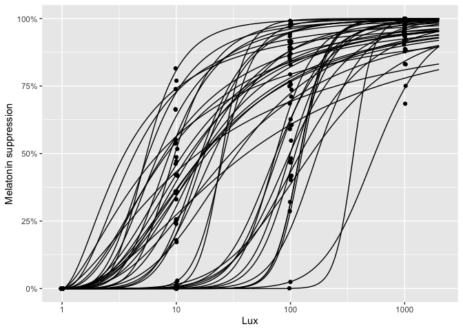

<!-- README.md is generated from README.Rmd. Please edit that file -->
chronodoseresponse
==================

<!-- badges: start -->
[](https://github.com/ben18785/chronodoseresponse/actions) <!-- badges: end -->

The goal of chronodoseresponse is to allow generation of virtual dose-response type data typical in chronobiology experiments.

Installation
------------

You can install chronodoseresponse via:

``` r
devtools::install_github("ben18785/chronodoseresponse")
```

Example
-------

This shows how to generate simulated experimental dose-response data, then plots it.

``` r
library(chronodoseresponse)
# generate dose-response data for 41 individuals measured at four lux levels
experimental_data <- virtual_experiment(n=41, lux=c(1, 10, 100, 1000))

# plot data
plot_doseresponse(experimental_data)
```


